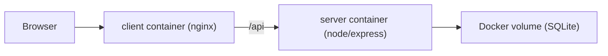

# OpenClaw 引継ぎ資料

## 1. このプロジェクトの概要

- プロジェクト名: Agentic Coding Tools
- 用途: ツール一覧表示、詳細表示、お気に入り登録を行うシンプルな SPA
- フロントエンド: React 19 + Vite + React Query
- バックエンド: Express 5 + TypeScript
- データストア: SQLite
- 配置前提: AWS 上の Linux サーバー 1 台に Docker / Docker Compose を導入して運用

この資料は、OpenClaw が「現状把握」「デプロイ」「運用開始」までを短時間で引き継げるようにすることを目的としています。

## 2. 現在の構成



### アプリ構成

- `client/`
  - Vite でビルドされる SPA
  - API 呼び出しは `/api/...` に統一済み
  - Docker 本番構成では Nginx が静的配信と API プロキシを担当
- `server/`
  - Express API
  - 起動時に SQLite テーブル作成と初期データ投入を実施
  - `DB_PATH`, `PORT`, `CORS_ORIGIN` を環境変数から受け取る

## 3. 今回整理したポイント

### デプロイしやすくした点

- フロントの `localhost:3001` 直書きを廃止
- Vite 開発時は `/api` をローカル API にプロキシ
- Express に `/api/health` を追加
- サーバーの起動設定を `dev / build / start` に整理
- SQLite の保存先を `DB_PATH` で差し替え可能に変更
- Dockerfile を `client` / `server` に追加
- ルートに `docker-compose.yml`, `.env.example`, `README.md` を追加

### 運用上の意味

- ローカル開発と本番運用で URL 設定を分けずに済む
- AWS 上では `docker compose up -d` だけで最低限の起動が可能
- SQLite ファイルがコンテナ再作成で消えない
- 死活確認をヘルスチェックで機械的に確認できる

## 4. 起動方法

### ローカル開発

```bash
cd server && npm install && npm run dev
cd client && npm install && npm run dev
```

- フロント: `http://localhost:5173`
- API: `http://localhost:3001`

### Docker 本番想定

```bash
cp .env.example .env
docker compose up --build -d
docker compose ps
```

- Web 公開ポート: `.env` の `WEB_PORT`
- API ホスト側ポート: `.env` の `SERVER_PORT`

## 5. AWS サーバーへのデプロイ手順

前提:
- 想定対象は EC2 などの単一 Linux サーバー
- Docker Engine と Docker Compose Plugin がインストール済み
- 80 番ポートを公開可能
- 可能なら 443/TLS は別レイヤで終端

### 推奨手順

1. サーバーへソースを配置
2. `.env.example` をコピーして `.env` を作成
3. `docker compose up --build -d`
4. `docker compose ps` で `healthy` を確認
5. `http://<server-ip>/` で画面表示確認
6. `curl http://127.0.0.1:3001/api/health` で API 確認

### セキュリティグループの最小構成

- `80/tcp`: 公開
- `22/tcp`: 管理元 IP のみ許可
- `3001/tcp`: 原則非公開でよい

## 6. 環境変数

| 変数名 | 使う場所 | 既定値 | 用途 |
|---|---|---:|---|
| `WEB_PORT` | root `.env` | `80` | フロント公開ポート |
| `SERVER_PORT` | root `.env` | `3001` | API のホスト側公開ポート |
| `CORS_ORIGIN` | server | `*` | バックエンド CORS 許可設定 |
| `PORT` | server container | `3001` | Express リッスンポート |
| `DB_PATH` | server container | `/app/data/db.sqlite` | SQLite 保存先 |

## 7. 運用メモ

### ログ確認

```bash
docker compose logs -f client
docker compose logs -f server
```

### 再起動

```bash
docker compose restart
```

### 再ビルド反映

```bash
docker compose up --build -d
```

### DB バックアップ

SQLite を volume に保存しているため、ホスト上の Docker volume バックアップが必要です。  
本番継続運用するなら、以下のどちらかを早めに決めるのが安全です。

- 当面は SQLite volume を定期バックアップ
- 中長期では RDS などの外部 DB に移行

## 8. 既知の注意点

### 1. 文字化けの可能性

ソース内の一部日本語テキストが環境によって文字化けして見える箇所があります。  
UI 表示品質を上げるなら、ファイルエンコーディングを UTF-8 で統一して文言を確認し直してください。

### 2. 認証は簡易実装

ログインは username のみで、実質的には匿名識別子です。  
外部公開レベルの本番運用にするなら、少なくとも以下の検討が必要です。

- 認証方式の導入
- CSRF / rate limit
- 監査ログ

### 3. SQLite のスケール制約

単一サーバー・小規模運用には十分ですが、複数台構成や高トラフィックには向きません。

## 9. OpenClaw に最初にお願いしたいこと

優先度順で以下を推奨します。

1. AWS の実サーバー要件を確定する
2. ドメイン有無と HTTPS 終端方式を決める
3. 永続化方針を SQLite 継続にするか、RDS へ寄せるか決める
4. UI 文言の文字化け確認を実施する
5. デプロイ後の簡易監視とバックアップ手順を定義する

## 10. 判断に迷ったときの基準

- まずは単一 EC2 + Docker Compose で最短リリース
- その後、監視・TLS・DB を段階的に強化
- 早い段階で SQLite のバックアップだけは自動化

このプロジェクトはまだ小さいので、過度に複雑な AWS 構成へ広げるより、まずは「単純で再現可能」な運用を作るのが引継ぎしやすいです。
